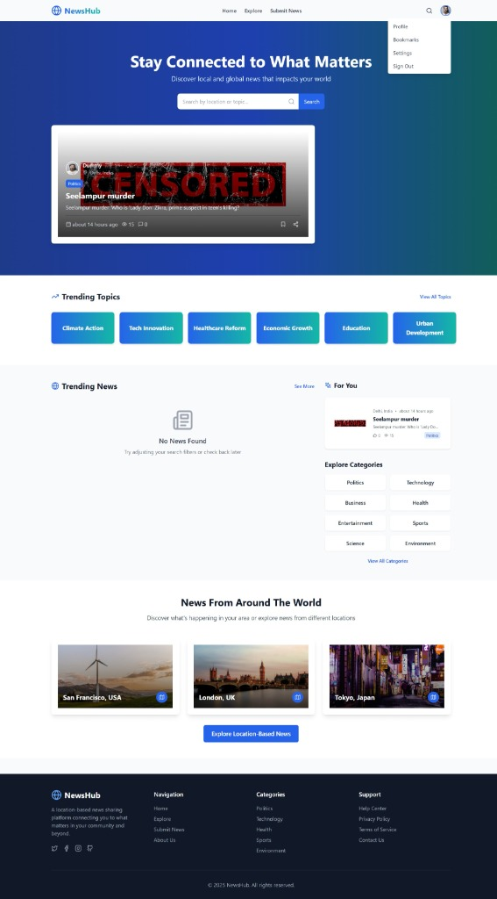

# NewsHub

A location-based news sharing platform built with React, TypeScript, Vite, and Tailwind CSS.

## Features
- Location-based, trending, and personalized news feeds
- Modular, component-driven architecture
- Mock data for users, news, and comments
- Responsive design using Tailwind CSS
- TypeScript type safety throughout
- Modern React features (hooks, context, error boundaries)
- Lucide React icons for a modern UI
- Error boundaries and robust error handling

## Project Structure
```
project/
├── public/
├── src/
│   ├── components/
│   ├── context/
│   ├── pages/
│   ├── utils/
│   ├── types.ts
│   ├── main.tsx
│   └── index.css
├── index.html
└── README.md
```

## Getting Started


### Prerequisites
- Node.js (v16+ recommended)
- npm (v8+ recommended)

### Installation
1. Clone the repository:
   ```sh
   git clone <your-repo-url>
   cd project
   ```
2. Install dependencies:
   ```sh
   npm install
   ```

### Running the App
Start the development server:
```sh
npm run dev
```
The app will be available at [http://localhost:5173](http://localhost:5173).

### Building for Production
To build the app for production:
```sh
npm run build
```

### Linting & Formatting
To check for lint errors and format code:
```sh
npm run lint
npm run format
```

## Technologies Used
- [React](https://reactjs.org/)
- [TypeScript](https://www.typescriptlang.org/)
- [Vite](https://vitejs.dev/)
- [Tailwind CSS](https://tailwindcss.com/)
- [Lucide React](https://lucide.dev/)

## Notes
- The project uses mock data for demonstration and development purposes.
- Focus is on clean, maintainable code and a modern, responsive UI.

## Screenshots

### Home Page
<p align="center">
  <br>
  <em>Stay Connected to What Matters – Discover local and global news that impacts your world.</em>
</p>


### Submit News Page
<p align="center">
  <br>
  <em>Submit important stories with the community using a simple, guided form.</em>
</p>

## License

This project is licensed under the [Creative Commons Attribution-NonCommercial 4.0 International (CC BY-NC 4.0)](https://creativecommons.org/licenses/by-nc/4.0/).

[](https://creativecommons.org/licenses/by-nc/4.0/)

